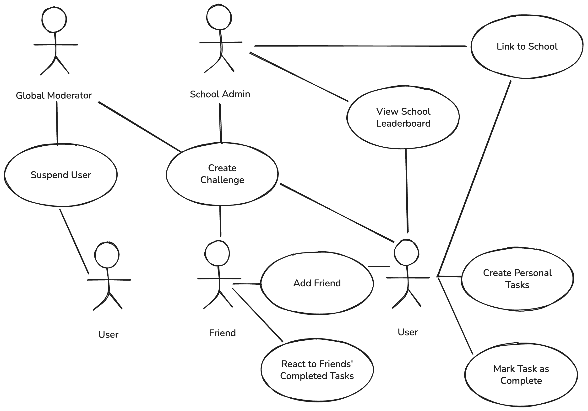
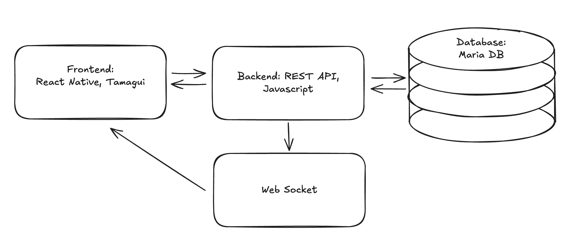

# Sensei Productivity (CSDS393 Group17)
Productivity social media app. Users are able to set goals, track progress, and celebrate achievements on their social feed. The platform intends to create a positive environment where users feel encouraged to stay committed to their productivity goals in a positive peer-pressure environment. Ultimately, Sensei’s vision is to become a hub for socially encouraged productivity through goal setting and task tracking. 

## Architecture Overview
Our architecture is fairly straightforward. The project can be thought of as entirely in the frontend with the backend API and SDK as dependencies. The frontend communicates with the backend via the SDK, and the backend communicates with the database via Prisma, our ORM. In addition, we have a web socket feature implemented for real-time multi-user communication. (The use case for this is that a user can see when their friends post completed tasks in real-time without needing to refresh the app.)

Figure 1: UML diagram. The global moderator in the top left is the most privileged user, and they have the ability to ban other users among other things. The school admin can create challenges. Typical users have all the usual functionality, such as creating tasks, marking them as done, viewing their feed with their friends' completed tasks, checking the school leaderboard, etc.

Figure 2: System architecture overview. Displays the frontend, backend, and database (and web socket). 

## Tech Stack & Major Dependencies
Frontend: React Native (Expo), Tamagui, Expo Router

Backend: TypeScript, Fastify, Socket.IO

Database: Prisma, MariaDB

## Installation & Setup Steps

### All code resides in the `sensei-productivity` folder

Run `yarn` command within the `sensei-productivity` folder. 

Ensure XCode and/or Android Studio is installed then navigate to `sensei-productivity/apps/expo`

* Running iOS app: `yarn ios`
* Running Android app: `yarn android`

## Usage Example
Try logging in with the following credentials:

username: Atri

password: Antonios12!

Click the different icons at the bottom to see the different screens. Here are some examples of what a user might do.
- Home page: create tasks by clicking "New Task" and populating all fields.
- Home page: mark tasks as done by clicking the checkmark.
- Feed page: view tasks previously posted by friends (Kaia, Hilary, Antonios)
- Leaderboard page: view school rankings
- Profile page: see past posts from user

## Repo Folder Overview

> CSDS-393-Group-17

>> /sensei-productivity Directory containing all the code for this project.

>>> /apps Contains the two deployable applications

>>>> /expo React Native (Expo) mobile app.

>>>> /next Next.js web app. We chose not to pursue this direction.

>>> /packages Shared code that would be used by both apps.

>>>> /app Business logic

>>>>> /features Screen-level feature modules

>>>>> /api API client layer (senseiClient.ts)

>>>>> /provider React context providers shared across platforms.

>>>>> /utils Utilities and helpers.

>>>> /ui Shared UI component library (Tamagui-based)

>>>> /config Shared configuration (Tamagui theme, fonts, animations)

## Team Member Roles and Contributions

Antonios: REST API, REST API SDK, Socket.IO, Front-End Integration

Atri: Backend, REST API

Hilary: Frontend, UI Design, Team Lead

Kaia: Database, Frontend

## Lessons Learned

We learned many lessons through this group project! Some technical things that we learned include the following:
- Fixing broken builds & debugging build/execution errors
- Unit testing: Seeding test database w/ Foreign Key relations
- Frontend testing: Learned how to test components
- Android studio emulator: Learned to reset the emulator often to clear issues
- REST API: Learned proper async/await, promise syntax
- Github: Handling PRs, using `git patch`

In addition, we learned interpersonal skills such as communication and organization. We figured out how to communicate with each other as a group, how often to meet, when not to meet, etc. We built teamwork and leadership skills over the course of this project.